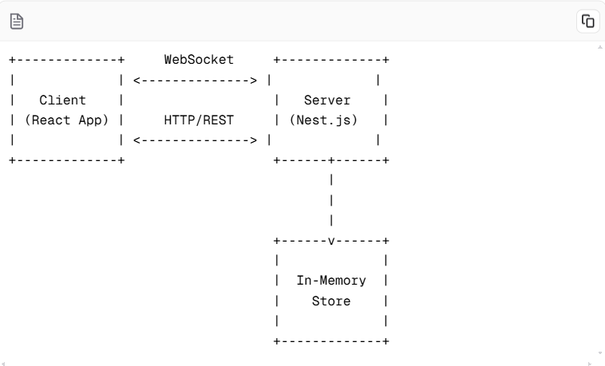

Architecture Diagram:

Component Description:

a. Client (React App):

- Renders the user interface for the quiz
- Manages local state for user interactions
- Communicates with the server via WebSocket for real-time updates
- Handles user authentication and quiz joining/creation

b. Server (Nest.js):

- Manages WebSocket connections with clients
- Implements game logic for quiz sessions
- Handles user authentication and session management
- Manages in-memory data store for active quiz sessions
- Broadcasts real-time updates to connected clients

c. In-Memory Store:

- Stores active quiz sessions, including questions, user data, and scores
- Provides fast access to quiz data for real-time operations

3. Data Flow:

a. User Joins a Quiz:

1. User enters name and quiz ID on the client
2. Client sends a 'joinQuiz' event to the server via WebSocket
3. Server validates the quiz ID and adds the user to the quiz session
4. Server sends the current quiz state to the new user
5. Server broadcasts a 'userJoined' event to all participants in the quiz

b. Quiz Progression:

1. Server sends a 'newQuestion' event to all participants
2. Clients display the new question and answer options
3. User selects an answer on the client
4. Client sends a 'submitAnswer' event to the server
5. Server validates the answer and updates the user's score
6. Server broadcasts a 'leaderboardUpdate' event to all participants
7. Server sends a 'questionUpdate' event to update the question counter
8. Process repeats for each question until the quiz ends

c. Quiz Ends:

1. Server detects that all questions have been answered
2. Server sends a 'quizEnded' event to all participants
3. Clients display the final leaderboard and quiz results
4. Technologies and Tools:

a. Frontend:

- React: Chosen for its component-based architecture and efficient rendering
- TypeScript: Provides static typing for improved code quality and developer experience
- Socket.io-client: Enables real-time communication with the server
- Tailwind CSS: Offers utility-first CSS for rapid UI development

b. Backend:

- Nest.js: Provides a structured and scalable framework for building Node.js applications
- TypeScript: Ensures type safety and improves code maintainability
- Socket.io: Enables real-time, bidirectional communication between server and clients
- In-memory data store: Offers fast data access for real-time quiz operations

c. Development Tools:

- npm: Package manager for installing and managing project dependencies
- ESLint: Ensures code quality and consistency
- Prettier: Maintains consistent code formatting
- Git: Version control system for collaborative development

Justification for Technology Choices:

1. React and Nest.js: Both are popular, well-maintained frameworks that provide a solid foundation for building scalable web applications. They offer excellent TypeScript support and have large communities for support and resources.
2. TypeScript: Enhances code quality, catches potential errors early in development, and improves maintainability, which is crucial for a real-time application.
3. Socket.io: Provides a reliable, real-time communication layer with fallback options, ensuring compatibility across different browsers and network conditions.
4. Tailwind CSS: Allows for rapid UI development and easy customization, which is beneficial for creating a responsive and visually appealing quiz interface.
5. In-memory data store: For this application's scale, an in-memory store provides the fastest possible data access, which is crucial for real-time updates. If the application needs to scale further, this could be replaced with a database like Redis for distributed caching.
